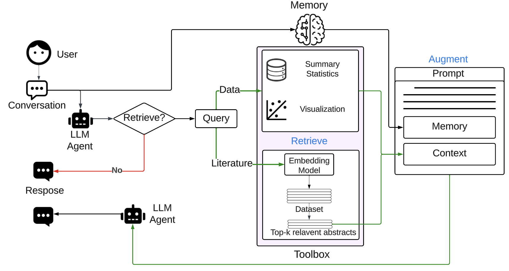
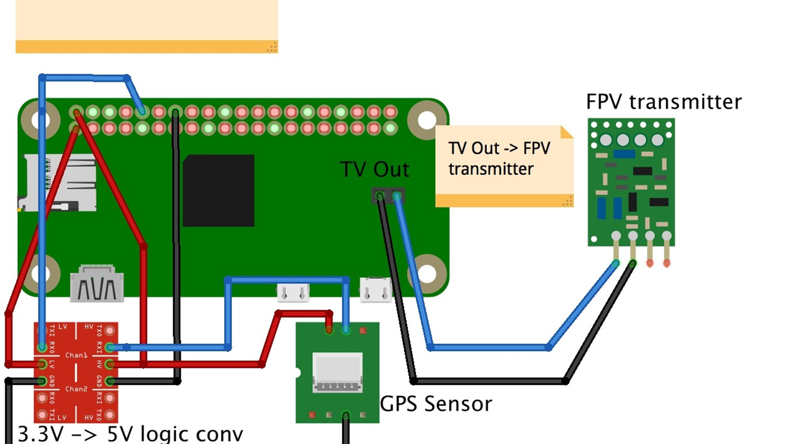

# Pyropulse
AI-driven early detection systems and autonomous technology revolutionize wildfire management
# AI-Driven Wildfire Detection and Autonomous Drone Management System

## Overview

Welcome to our GitHub repository! This project focuses on leveraging artificial intelligence for early wildfire detection and management through autonomous drone technology. By integrating machine learning algorithms with an advanced drone setup, we aim to revolutionize wildfire monitoring and response systems.

## Table of Contents
1. [Introduction](#introduction)
2. [Hardware Components](#hardware-components)
3. 
4. 
5. 
6. [Installation](#installation)
7. [Usage](#usage)
8. [License](#license)

## Introduction

Wildfires pose significant threats to the environment and communities. Our project combines state-of-the-art drone technology with machine learning to create an early detection and autonomous response system. The repository includes code for the drone's flight control, camera integration, and the machine learning model responsible for wildfire detection.

## Hardware Components

To build the autonomous drone system, you will need the following hardware components:

- LiteRadio 2 SE Radio
- F4 1S 12A AIO Brushless Flight Controller
- Pavo20 Brushless Whoop Frame
- Gemfan 2015 2-Blade Propellers
- Pavo Series COB LED Strip
- 1103 Brushless Motors 11000KV
- Raspberry Pi Zero 2 W
- Raspberry Pi Camera Module 3
- 900 mAh 2S Li-Po battery
- 2 resistors for a 5V to 3.3V voltage divider
- Soft sponge and rubber bands for mounting and dampening vibrations
- VR02 FPV Goggles
- DarwinFPV 5.8Ghz 25-200mW VTX for Baby Ape

  


## Methodology Overview

Our methodology involves the integration of an LLM agent with Retrieval-Augmented Generation (RAG), illustrated in Figure 1. The agent initiates the interaction by working with the user to create a profile and formulate an action plan. Subsequently, the RAG enhances the LLM's responses, incorporating additional information such as climate projections and scientific literature in alignment with the agent-generated context.

## Prototype Focus

The primary focus of our prototype revolves around capturing three critical elements in a consulting scenario:

1. **Inquiring for Clarification:**
   The agent asks clarifying questions to gain a comprehensive understanding of the user's concerns.

2. **Strategic Planning and Communication:**
   Planning and communicating a strategy to effectively address the user's concerns.

3. **Providing Information:**
   Offering and explaining pertinent quantitative and qualitative information to the user.

## Conversation Modules

Our LLM agent seamlessly transitions through these three stages in a conversation with the user, facilitated by the following modules:

1. **User Profile Module**
2. **Planning Module**
3. **Memory Module**
4. **Toolbox Module**

  


## Installation

Follow these steps to set up the AI-driven wildfire detection system:

1. Clone the repository to your local machine.
   ```bash
   git clone https://github.com/khaled22salama/Pyropulse.git
   ```


2. Connect and configure the hardware components according to the provided documentation.
   

## Usage

1. Upload the drone control code to the flight controller.
2. Integrate the camera code with the Raspberry Pi Camera Module 3.
3. Deploy the machine learning code for wildfire detection on the Raspberry Pi Zero 2 W.
4. Power up the drone, ensuring all components are functioning correctly.

Check the code for [Drone](Drone).
check the code for [machine learning model & dataset](Dataset)


## License

This project is licensed under the [MIT License](LICENSE). Feel free to use, modify, and distribute the code for your own projects.

Thank you for your interest in our AI-driven wildfire detection and autonomous drone management system! If you have any questions or issues, please don't hesitate to [open an issue](https://github.com/khaled22salama/Pyropulse/issues).
